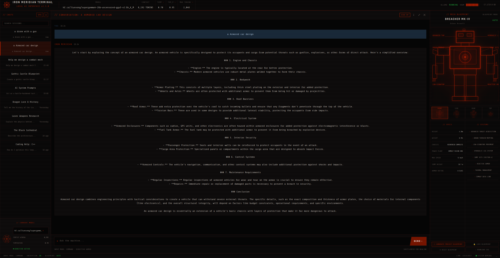

# Iron Meridian Terminal

A local AI interface for Ollama inspired by:

- SUPERHOT
- Cyberpunk 2077
- Metal Slug blueprint screens
- Military command consoles

## Features

- Local Ollama integration
- Streaming chat
- Dynamic blueprint panel
- Editable model settings
- Military sci-fi UI

## Install

git clone https://github.com/pomflord-commits/Iron-Meridian-Terminal.git

cd iron-meridian-terminal

npm install

npm run dev

## Requires

- Node.js
- Ollama

Iron-Meridian-Terminal/main-ui.png
